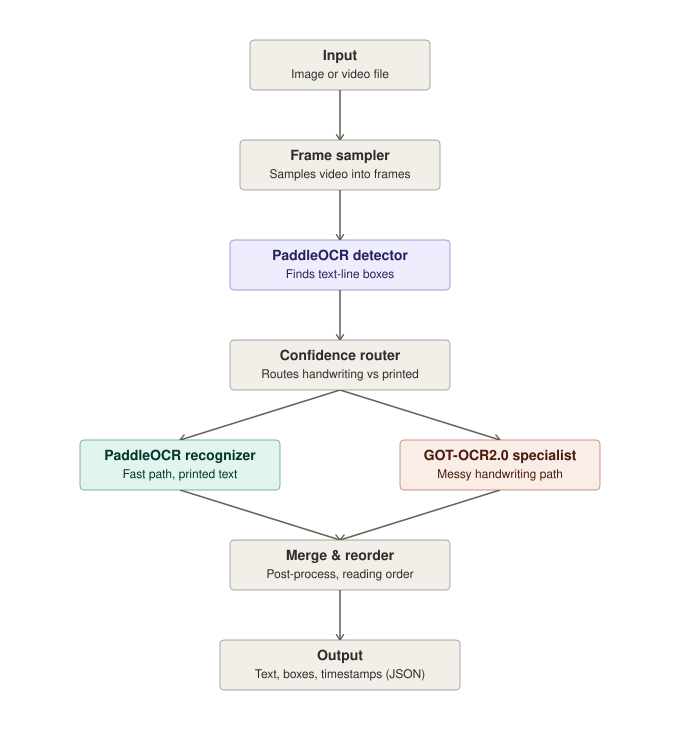

# OCR implementation

OCR pipeline for images and video that combines [PaddleOCR](https://github.com/PaddlePaddle/PaddleOCR) for fast text detection/recognition with [GOT-OCR2.0](https://github.com/Ucas-HaoranWei/GOT-OCR2.0) as a specialist recognizer for messy/cursive handwriting, plus a small local LLM that cleans up OCR spelling errors.

## Why two OCR models

PaddleOCR's detector (PP-OCRv6, DBNet) is fast and mature, and its recognizer handles printed text well — but it's noticeably weaker on messy cursive handwriting. GOT-OCR2.0 is a newer unified OCR model that performs much better on handwriting, at higher compute cost. Rather than running the heavy model on every crop, a confidence router escalates only the crops PaddleOCR is unsure about.

## Why an LLM cleanup stage

Even a correctly-routed recognition can still misread individual characters ("seaules infrasture fir" instead of "seamless infrastructure for"). A small instruction-tuned LLM (Qwen2.5-1.5B-Instruct) corrects these after the fact, given the whole document's lines as context — not line-by-line, since a line cut mid-phrase by the line detector is often ambiguous in isolation and only resolves correctly with its neighbors. It's additive, not authoritative: the raw OCR text is always kept alongside the corrected version, and the GUI defaults to showing the correction with a toggle to fall back to the raw read.

## Architecture

1. **Input** — an image or a video file.
2. **Frame sampler** — for video, samples frames (fixed FPS) and dedupes near-identical ones; images pass through unchanged. (Scene-change sampling mode is not yet implemented.)
3. **PaddleOCR detector** — PP-OCRv6 (DBNet) locates text-line bounding boxes.
4. **Confidence router** — runs the PaddleOCR recognizer on each crop; boxes below a confidence threshold are escalated.
5. **PaddleOCR recognizer** (fast path) — handles confidently printed text.
6. **GOT-OCR2.0** (specialist path) — handles messy handwriting the fast path is unsure about.
7. **Merge & reorder** — combines results from both paths, restores reading order.
8. **LLM cleanup** — corrects OCR spelling/typo errors across the merged text, with the original OCR text kept alongside the correction.
9. **Output** — text + bounding boxes (+ timestamps for video frames) as JSON, plus a web GUI for uploading files and inspecting results.

## Status

Implemented and browser-tested end-to-end, including against a real photo of handwritten notes. See [STEPS_TO_DEVELOP.md](STEPS_TO_DEVELOP.md) for the full setup log, environment gotchas found along the way, and known limitations.

## Roadmap

- [x] Frame sampler for video input (fixed-FPS mode)
- [x] PaddleOCR detection + recognition integration
- [x] Confidence-based routing logic
- [x] GOT-OCR2.0 integration for handwriting
- [x] Merge/post-process step
- [x] JSON output schema
- [x] LLM cleanup pass for OCR typos
- [x] UI for uploading images/video and viewing results
- [ ] Scene-change frame sampling mode
- [ ] Kubeflow/KServe deployment for real-time inference
