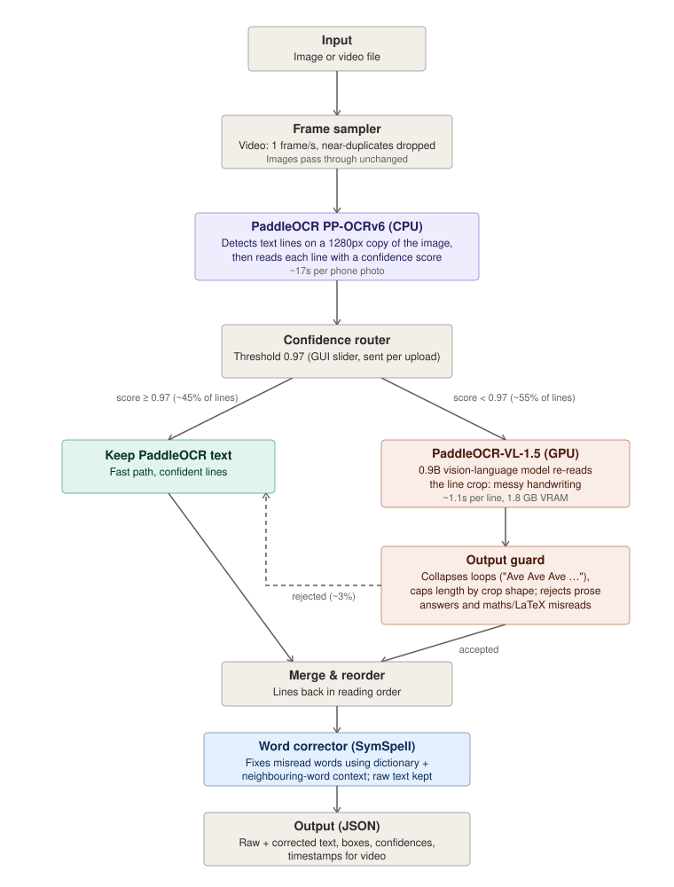
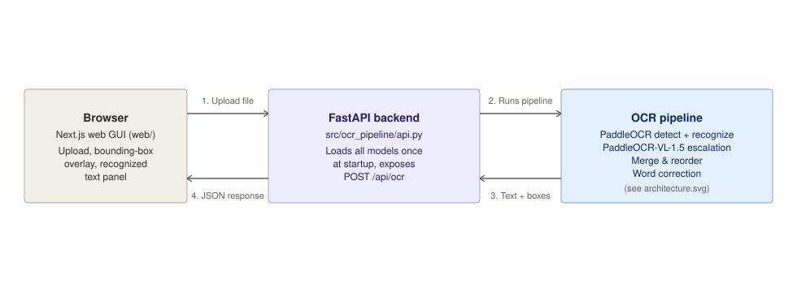

# OCR implementation

OCR pipeline for images and video that combines [PaddleOCR](https://github.com/PaddlePaddle/PaddleOCR) for fast text detection/recognition with [GOT-OCR2.0](https://github.com/Ucas-HaoranWei/GOT-OCR2.0) as a specialist recognizer for messy/cursive handwriting, plus a word-level corrector that fixes OCR misreads.

## Why two OCR models

PaddleOCR's detector (PP-OCRv6, DBNet) is fast and mature, and its recognizer handles printed text well — but it's noticeably weaker on messy cursive handwriting. GOT-OCR2.0 is a newer unified OCR model that performs much better on handwriting, at higher compute cost. Rather than running the heavy model on every crop, a confidence router escalates only the crops PaddleOCR is unsure about.

## Why a word-level correction stage

Even a correctly-routed recognition can still misread individual characters ("olease", "oudget", "fir our"). `word_corrector.py` fixes these one word at a time and leaves every other word untouched. It works on the whole document, not line by line, because neighbouring lines give context.
- **Non-dictionary words:** gets candidate spellings from SymSpell and ranks them by how often each appears next to its neighbours.
- **Real-word misreads:** changes a real word ("fir") only on lines PaddleOCR was unsure about, and only when the replacement strongly fits its neighbours ("for our").
- **Dropped spaces:** splits run-together lines into words.
- **Left alone:** names, acronyms, numbers and abbreviations ("recvd").

It's additive, not authoritative. The raw OCR text is always kept alongside the correction, and the GUI has a toggle to show the raw read.

It replaced a whole-document LLM rewrite (Qwen2.5-1.5B-Instruct, still available as `llm_cleanup` in `config/config.yaml`, off by default). On the benchmark below, the LLM made accuracy worse: it capitalised line starts, swapped in synonyms ("rush" → "expedite") and invented words ("oudget" → "Outgotten"). It also pushed GPU memory past 4 GB. Text-only correction has a limit: a badly misread word ("infrasture", 4 letters off) can't be recovered from text, so those need an image re-read.

## Benchmark

`scripts/benchmark.py` measures per-stage latency, GPU memory and character/word error rate on any folder of images with same-named `.txt` transcriptions. `scripts/make_synthetic_benchmark.py` generates a starter set from handwriting-style fonts. That set is much cleaner than real cursive, so decisions still need confirming on real images in `benchmark/real/`. `benchmark/` is git-ignored.

Measured on 10 synthetic 3–6 line images, on a laptop with an RTX 3050 (4 GB):

| | Before | After |
|---|---|---|
| Mean time per image | 56.6s | 7.5s |
| Character error rate of the text shown in the GUI | 3.19% | 0.06% |
| Word error rate | 13.65% | 0.34% |
| Peak GPU memory | 7.2 GB (spilling into system RAM) | 4.07 GB |

What changed:
- GOT-OCR2.0 only runs on lines below the threshold the GUI sends with each upload (it used to run on every line).
- One correction pass instead of two.
- The word corrector replaces the LLM.
- PaddleOCR's document unwarping is off: on flat images it distorted letters and cost about 1.3s.

Remaining time is PaddleOCR on CPU. GOT-OCR2.0 takes about 2s per escalated line, can't batch on a 4 GB GPU, and was less accurate than PaddleOCR on the synthetic set. Comparing stronger handwriting models on real images is the next step.

## Architecture

1. **Input** — an image or a video file.
2. **Frame sampler** — for video, samples frames (fixed FPS) and dedupes near-identical ones; images pass through unchanged. (Scene-change sampling mode is not yet implemented.)
3. **PaddleOCR detector** — PP-OCRv6 (DBNet) locates text-line bounding boxes.
4. **Confidence router** — runs the PaddleOCR recognizer on each crop; boxes below a confidence threshold are escalated.
5. **PaddleOCR recognizer** (fast path) — handles confidently printed text.
6. **GOT-OCR2.0** (specialist path) — handles messy handwriting the fast path is unsure about.
7. **Merge & reorder** — combines results from both paths, restores reading order.
8. **Word correction** — fixes misread words across the merged text, with the original OCR text kept alongside the correction.
9. **Output** — text + bounding boxes (+ timestamps for video frames) as JSON, plus a web GUI for uploading files and inspecting results.

## Web app architecture

The diagram above is the OCR pipeline itself (a single request's processing steps). Around it: a Next.js browser GUI (`web/`) uploads a file to a FastAPI backend (`src/ocr_pipeline/api.py`), which loads the models once at startup (not per-request — reloading them per call would add 10s+ to every upload) and runs the pipeline, returning JSON that the browser renders as a bounding-box overlay and a recognized-text panel.

## Status

Implemented and browser-tested end-to-end, including against a real photo of handwritten notes. See [STEPS_TO_DEVELOP.md](STEPS_TO_DEVELOP.md) for the full setup log, environment gotchas found along the way, and known limitations.

## Roadmap

- [x] Frame sampler for video input (fixed-FPS mode)
- [x] PaddleOCR detection + recognition integration
- [x] Confidence-based routing logic
- [x] GOT-OCR2.0 integration for handwriting
- [x] Merge/post-process step
- [x] JSON output schema
- [x] LLM cleanup pass for OCR typos
- [x] UI for uploading images/video and viewing results
- [ ] Scene-change frame sampling mode
- [x] AWS EKS + KServe deployment applied to a real cluster — all four components (PaddleOCR, GOT-OCR2.0, LLM cleanup, orchestrator) live and verified end-to-end; GOT-OCR2.0/LLM cleanup run on CPU pending an AWS GPU-quota approval (see [deploy/README.md](deploy/README.md#current-deployment-status-2026-09-24) for live status, latency notes, and how to restore GPU)
